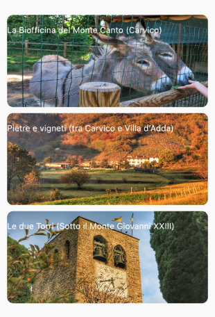

# biohunt

#CULTURAaiPiediDelCanto è un progetto pensato per aprire lo sguardo su un diverso modo di vivere il proprio territorio, e nello specifico il Monte Canto, luogo di riferimento nella storia e nella cultura non solo dei suoi abitanti ma di tutta la provincia bergamasca. L’idea centrale del progetto è quella di riscoprire il territorio del Monte Canto in una chiave nuova e dinamica: semplici missioni esplorative permetteranno di vivere delle esperienze di vera immersione in natura, acquisendo un senso di maggior consapevolezza rispetto al valore di un ambiente naturale prezioso e ricco di storia. Fare esperienza della natura diventa relazione in ogni momento della vita: è esperienza autentica e non mediata che trasforma l’ordinario in straordinario.

Questa applicazione (realizzata in Flutter), studiata e realizzata ad hoc, è il risultato di questo progetto: uno strumento concreto per riscoprire la vera essenza dell’esplorare, imparare a vedere con occhi nuovi ciò che ci circonda e scoprire, attraverso pillole di cultura, la storia di questo territorio.

## #CULTURAaiPiediDelCanto

> “Tu sei un esploratore. La tua missione è documentare e osservare il mondo intorno a te come se non l’avessi mai visto prima”
(Keri Smith).

Un progetto realizzato dall’Associazione Lumaca Ribelle, con il contributo della Fondazione della Comunità Bergamasca

### Esplora il Monte Canto

Cliccando sulle immagini potrai accedere ai percorsi e sperimentare le attività proposte.\n\nPrima di partire ricordati di consultare la sezione Crea il tuo Kit per non dimenticare alcuni oggetti fondamentali per le tue esplorazioni

### Le tappe

Ogni percorso è composto da diverse tappe. Clicca su ciascuna tappa per visualizzare il tragitto, scoprire le attività proposte e leggere qualche curiosità sul territorio

### Completa tutte le tappe

Dopo aver completato la tappa, premi il tasto di conferma. Il tuo obiettivo è completare tutti i punti del percorso

### Vuoi rivivere le attività?

Clicca sul pulsante Tappe Completate per rivedere le attività che hai già scoperto, rivivere ogni singola tappa oppure ricominciare da capo rifacendo il percorso!

### Inizia l'esplorazione!
Inizia a esplorare il Monte Canto. Scegli un percorso e vivi l’avventura. L'app si trova su Google Play a App Store.
Buona esplorazione

# MIT License

Copyright (c) 2020 Associazione Lumaca Ribelle

Permission is hereby granted, free of charge, to any person obtaining a copy
of this software and associated documentation files (the "Software"), to deal
in the Software without restriction, including without limitation the rights
to use, copy, modify, merge, publish, distribute, sublicense, and/or sell
copies of the Software, and to permit persons to whom the Software is
furnished to do so, subject to the following conditions:

The above copyright notice and this permission notice shall be included in all
copies or substantial portions of the Software.

THE SOFTWARE IS PROVIDED "AS IS", WITHOUT WARRANTY OF ANY KIND, EXPRESS OR
IMPLIED, INCLUDING BUT NOT LIMITED TO THE WARRANTIES OF MERCHANTABILITY,
FITNESS FOR A PARTICULAR PURPOSE AND NONINFRINGEMENT. IN NO EVENT SHALL THE
AUTHORS OR COPYRIGHT HOLDERS BE LIABLE FOR ANY CLAIM, DAMAGES OR OTHER
LIABILITY, WHETHER IN AN ACTION OF CONTRACT, TORT OR OTHERWISE, ARISING FROM,
OUT OF OR IN CONNECTION WITH THE SOFTWARE OR THE USE OR OTHER DEALINGS IN THE
SOFTWARE.